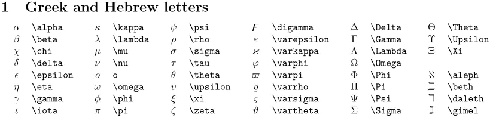
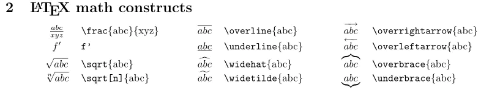
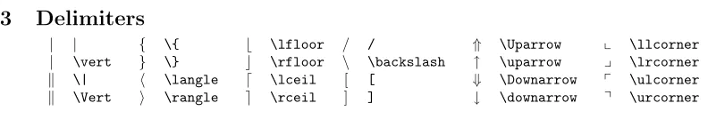
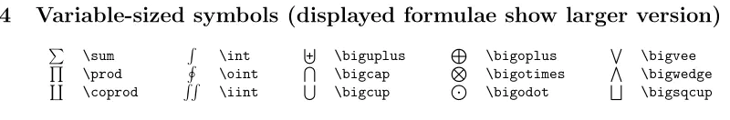
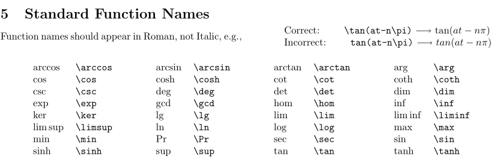
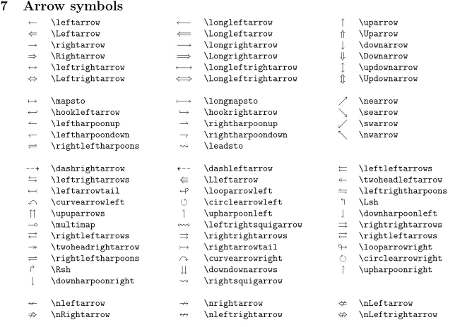
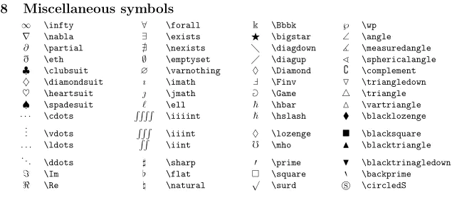

# <font color=#39c5bb>Grammar</font>
> <font color=#ffa500>markdown能被转译为html</font>

## <font color=#39c5bb>标题</font>
* <font color=#ff0044>以#数目表示</font>
```markdown
# H1
## H2
### H3
```

* <font color=#ff0044>文本下方任意数量的=或-号标识1、2级(文本上空行)</font>
```markdown

H1
===

H2
---
```

## <font color=#39c5bb>段落</font>

* <font color=#ff0044>使用空白行将一行或多行文本进行分隔</font>

等价于使用\<p\>标签
```markdown
p1

p2

&nbsp;&nbsp;p3
```

## <font color=#39c5bb>换行</font>
* <font color=#ff0044>末尾加两个或多个空格后回车，等价于\<br\></font>

## <font color=#39c5bb>强调</font>

```markdown
*斜体*
_斜体_
<em>斜体</em>

**粗体**
__粗体__
<strong>粗体</strong>

***粗斜体***

~~删除线~~

<ins>下划线</ins>
```

## <font color=#39c5bb>引用</font>
```markdown
> 引用段1
>
> 引用段2
>> 引用嵌套
```

> 引用段1
>
> 引用段2
>> 引用嵌套

## <font color=#39c5bb>列表</font>
> <font color=#ffa500>元素与列表保持缩进</font>
* <font color=#ff0044>有序列表</font>
```markdown
1. a
2. b
3. c

<ol>
<li>a</li>
<li>b</li>
<li>c</li>
</ol>
```

* <font color=#ff0044>无序列表</font>
```markdown
* a
* b
* c

+ a
+ b
+ c

- a
- b
- c

<ul>
<li>a</li>
<li>b</li>
<li>c</li>
</ul>
```

* <font color=#ff0044>任务列表(标上x表示完成)</font>
```markdown
- [x] task1
- [ ] task2
- [ ] task3
```

## <font color=#39c5bb>代码块</font>

```markdown
`codeblock`
<code>codeblock</code>
`` `nest` ``
<code>\`nest\`</code>
```

* <font color=#ff0044>缩进式代码块(4space or 1tab)</font>
```markdown
    code1
    code2
```

* <font color=#ff0044>围栏式代码块(多重用于嵌套)</font>
`````markdown
1.
~~~~
code1
code2
~~~
nest1
nest2
~~~
~~~~

2.
````
code1
code2
```
nest1
nest2
```
````
`````

## <font color=#39c5bb>分割线</font>
* <font color=#ff0044>独占一行(3个或以上)</font>
```markdown
***
---
___
```

## <font color=#39c5bb>链接</font>
```markdown
[超链接显示名](超链接地址 "超链接title")

[超链接显示名][label]
[lable]:超链接地址 "超链接title"

<a href="超链接地址" title="超链接title">超链接显示名</a>

<url>
<email>
```


## <font color=#39c5bb>图片视频</font>
```markdown


![图片alt][lable]
[lable]:图片链接 "图片title"


<video width="500" controls>
  <source src="./video.mp4" type="video/mp4">
  Your browser does not support the video tag.
</video>
```

## <font color=#39c5bb>表格</font>
* <font color=#ff0044>管道分隔列</font>
```markdown
|title1|title2|
|---|---|
|text1|text2|
|...|...|

|左对齐|居中|右对齐|
|:-|:-:|-:|
|text1|text2|text3|
|...|...|...|
```

## <font color=#39c5bb>脚注</font>
* <font color=#ff0044>脚注会自动编号</font>
```markdown
[^id]
[^id]:content.
```


## <font color=#39c5bb>转义</font>
* <font color=#ff0044>对于下面的字符需要`\`转义</font>
```markdown
\	backslash
`	backtick (see also escaping backticks in code)
*	asterisk
_	underscore
{ }	curly braces
[ ]	brackets
( )	parentheses
#	pound sign
+	plus sign
-	minus sign (hyphen)
.	dot
!	exclamation mark
|	pipe (see also escaping pipe in tables)
```

## <font color=#39c5bb>字体颜色</font>
```markdown
<font color=#rgb >content</font>
```
> <font color=#39c5bb>Miku#39C5BB</font>
> <font color=#ffa500>Rin#FFA500</font>
> <font color=#ff0044>Teto#FF0044</font>

## <font color=#39c5bb>公式</font>
```markdown
$ A_{n}^{m} = \frac{n!}{(n-m)!} $    
$ C_{n}^{m} = \frac{n!}{(n-m)!m!} $

$$
\begin{cases}
\frac{x^2}{p_{x2}} + \frac{y^2}{p_{y2}} = 1\\
p _x x + p _y y + p =0
\end{cases}
\Rightarrow
\begin{cases}
a = p _{x2}  p _x ^2 + p _{y2}  p _y ^2, \\     
\begin{cases} \\
b _x = 2 p _{x2} p _x p \\
c _x =  p _{x2} (p^2 - p _{y2}p _y ^2) 
\end{cases} \\
\begin{cases}
b _y = 2 p _{y2} p _y p \\
c _y =  p _{y2} (p^2 - p _{x2}p _x ^2) 
\end{cases}
\end{cases}
$$
```


# <font color=#39c5bb>markdown数学表达参考</font>










# <font color=#39c5bb>EMOJI reference list</font>
* <font color=#ff0044>popular list</font>

|:sparkles:`:sparkles:`|:rocket:`:rocket:`|:tada:`:tada:`|
|---|---|---|
|:star:`:star:`|:fire:`:fire:`| :boom: `:boom:`|
| :innocent: `:innocent:` |:smile: `:smile:`| :laughing: `:laughing:` |
| :yellow\_heart: `:yellow\_heart:` |:black\_heart: `:black\_heart:`|:gift\_heart: `:gift\_heart:`|
| :blue\_heart: `:blue\_heart:` | :purple\_heart: `:purple\_heart:` |:heart: `:heart:`|
|:green\_heart: `:green\_heart:`| :broken\_heart: `:broken\_heart:` |:heartbeat: `:heartbeat:`|
| :heartpulse: `:heartpulse:` | :two\_hearts: `:two\_hearts:` | :revolving\_hearts: `:revolving\_hearts:` |
|:cupid: `:cupid:`|:sparkling\_heart: `:sparkling\_heart:`| :sparkles: `:sparkles:` |
| :anger: `:anger:` |:star2: `:star2:`|:dizzy: `:dizzy:`|
|:exclamation: `:exclamation:`| :question: `:question:` | :grey\_exclamation: `:grey\_exclamation:` |
|:grey\_question: `:grey\_question:`|:zzz: `:zzz:`| :dash: `:dash:` |
|:sweat\_drops: `:sweat\_drops:`|:notes: `:notes:`| :musical\_note: `:musical\_note:` |
| :-1: `:-1:` | :+1: `:+1:` | :thumbsup: `:thumbsup:` |
|:punch: `:punch:`|:thumbsdown: `:thumbsdown:`| :ok\_hand: `:ok\_hand:` |
|:v: `:v:`| :wave: `:wave:` | :fist: `:fist:` |
|:raised\_hand: `:raised\_hand:`| :open\_hands: `:open\_hands:` | :point\_up: `:point\_up:` |
| :point\_down: `:point\_down:` | :point\_left: `:point\_left:` |:point\_right: `:point\_right:`|
| :raised\_hands: `:raised\_hands:` | :pray: `:pray:` | :point\_up\_2: `:point\_up\_2:` |
| :clap: `:clap:` | :muscle: `:muscle:` |:metal: `:metal:`|
|:sunny: `:sunny:`| :umbrella: `:umbrella:` | :cloud: `:cloud:` |
|:snowflake: `:snowflake:`|:snowman: `:snowman:`| :zap: `:zap:` |
|:cyclone: `:cyclone:`|:foggy: `:foggy:`| :ocean: `:ocean:` |
| :wine\_glass: `:wine\_glass:` | :cocktail: `:cocktail:` |:coffee: `:coffee:` |
|:champagne: `:champagne:` |:beer: `:beer:` | :beers: `:beers:`|

* <font color=#ff0044>物品类</font>

| :bell: `:bell:` |:no\_bell: `:no\_bell:`|:tanabata\_tree: `:tanabata\_tree:`|
| :-------------------------: | :-----------------: | :---------: |
| :tada: `:tada:` |:confetti\_ball: `:confetti\_ball:`|:balloon: `:balloon:`|
| :crystal\_ball: `:crystal\_ball:` | :cd: `:cd:` |:dvd: `:dvd:`|
|:floppy\_disk: `:floppy\_disk:`| :camera: `:camera:` | :video\_camera: `:video\_camera:` |
| :movie\_camera: `:movie\_camera:` | :computer: `:computer:` | :tv: `:tv:` |
| :iphone: `:iphone:` |:phone: `:phone:`|:telephone: `:telephone:`|
| :telephone\_receiver: `:telephone\_receiver:` |:pager: `:pager:`|:fax: `:fax:`|
| :minidisc: `:minidisc:` |:vhs: `:vhs:`|:sound: `:sound:`|
|:speaker: `:speaker:`| :mute: `:mute:` |:loudspeaker: `:loudspeaker:`|
| :mega: `:mega:` |:hourglass: `:hourglass:`| :hourglass\_flowing\_sand: `:hourglass\_flowing\_sand:` |
|:alarm\_clock: `:alarm\_clock:`|:watch: `:watch:`|:radio: `:radio:`|
|:satellite: `:satellite:`| :loop: `:loop:` |:mag: `:mag:`|
|:mag\_right: `:mag\_right:`| :unlock: `:unlock:` | :lock: `:lock:` |
|:lock\_with\_ink\_pen: `:lock\_with\_ink\_pen:`| :closed\_lock\_with\_key: `:closed\_lock\_with\_key:` |:key: `:key:`|
| :bulb: `:bulb:` | :flashlight: `:flashlight:` |:high\_brightness: `:high\_brightness:`|
| :low\_brightness: `:low\_brightness:` |:electric\_plug: `:electric\_plug:`|:battery: `:battery:`|
|:calling: `:calling:`|:email: `:email:`|:mailbox: `:mailbox:`|
|:postbox: `:postbox:`| :bath: `:bath:` |:bathtub: `:bathtub:`|
| :shower: `:shower:` | :toilet: `:toilet:` | :wrench: `:wrench:` |
| :nut\_and\_bolt: `:nut\_and\_bolt:` | :hammer: `:hammer:` | :seat: `:seat:` |
| :moneybag: `:moneybag:` |:yen: `:yen:`| :dollar: `:dollar:` |
|:pound: `:pound:`| :euro: `:euro:` |:credit\_card: `:credit\_card:`|
| :money\_with\_wings: `:money\_with\_wings:` | :e-mail: `:e-mail:` | :inbox\_tray: `:inbox\_tray:` |
|:outbox\_tray: `:outbox\_tray:`| :envelope: `:envelope:` |:incoming\_envelope: `:incoming\_envelope:`|
|:postal\_horn: `:postal\_horn:`| :mailbox\_closed: `:mailbox\_closed:` |:mailbox\_with\_mail: `:mailbox\_with\_mail:`|
| :mailbox\_with\_no\_mail: `:mailbox\_with\_no\_mail:` | :door: `:door:` |:smoking: `:smoking:`|
| :bomb: `:bomb:` |:gun: `:gun:`|:hocho: `:hocho:`|
| :pill: `:pill:` |:syringe: `:syringe:`| :page\_facing\_up: `:page\_facing\_up:` |
| :page\_with\_curl: `:page\_with\_curl:` |:bookmark\_tabs: `:bookmark\_tabs:`|:bar\_chart: `:bar\_chart:`|
| :chart\_with\_upwards\_trend: `:chart\_with\_upwards\_trend:` | :chart\_with\_downwards\_trend: `:chart\_with\_downwards\_trend:` | :scroll: `:scroll:` |
|:clipboard: `:clipboard:`| :calendar: `:calendar:` | :date: `:date:` |
| :card\_index: `:card\_index:` |:file\_folder: `:file\_folder:`| :open\_file\_folder: `:open\_file\_folder:` |
| :scissors: `:scissors:` |:pushpin: `:pushpin:`|:paperclip: `:paperclip:`|
|:black\_nib: `:black\_nib:`|:pencil2: `:pencil2:`| :straight\_ruler: `:straight\_ruler:` |
| :triangular\_ruler: `:triangular\_ruler:` |:closed\_book: `:closed\_book:`| :green\_book: `:green\_book:` |
|:blue\_book: `:blue\_book:`|:orange\_book: `:orange\_book:`| :notebook: `:notebook:` |
| :notebook\_with\_decorative\_cover: `:notebook\_with\_decorative\_cover:` | :ledger: `:ledger:` |:books: `:books:`|
| :bookmark: `:bookmark:` | :name\_badge: `:name\_badge:` | :microscope: `:microscope:` |
|:telescope: `:telescope:`|:newspaper: `:newspaper:`| :football: `:football:` |
| :basketball: `:basketball:` | :soccer: `:soccer:` | :baseball: `:baseball:` |
| :tennis: `:tennis:` |:8ball: `:8ball:`| :rugby\_football: `:rugby\_football:` |
|:bowling: `:bowling:`| :golf: `:golf:` | :mountain\_bicyclist: `:mountain\_bicyclist:` |
|:bicyclist: `:bicyclist:`| :horse\_racing: `:horse\_racing:` |:snowboarder: `:snowboarder:`|
|:swimmer: `:swimmer:`| :surfer: `:surfer:` |:ski: `:ski:`|
| :spades: `:spades:` | :hearts: `:hearts:` |:clubs: `:clubs:`|
| :diamonds: `:diamonds:` |:gem: `:gem:`| :ring: `:ring:` |
| :trophy: `:trophy:` |:musical\_score: `:musical\_score:`| :musical\_keyboard: `:musical\_keyboard:` |
| :violin: `:violin:` |:space\_invader: `:space\_invader:`| :video\_game: `:video\_game:` |
|:black\_joker: `:black\_joker:`| :flower\_playing\_cards: `:flower\_playing\_cards:` | :game\_die: `:game\_die:` |
| :dart: `:dart:` |:mahjong: `:mahjong:`|:clapper: `:clapper:`|
| :memo: `:memo:` | :pencil: `:pencil:` | :book: `:book:` |
|:art: `:art:`| :microphone: `:microphone:` | :headphones: `:headphones:` |
|:trumpet: `:trumpet:`|:saxophone: `:saxophone:`| :guitar: `:guitar:` |
| :shoe: `:shoe:` | :sandal: `:sandal:` |:high\_heel: `:high\_heel:`|
| :lipstick: `:lipstick:` | :boot: `:boot:` |:shirt: `:shirt:`|
| :tshirt: `:tshirt:` |:necktie: `:necktie:`| :womans\_clothes: `:womans\_clothes:` |
|:dress: `:dress:`|:running\_shirt\_with\_sash: `:running\_shirt\_with\_sash:`|:jeans: `:jeans:`|
| :kimono: `:kimono:` | :bikini: `:bikini:` | :ribbon: `:ribbon:` |
| :tophat: `:tophat:` |:crown: `:crown:`| :womans\_hat: `:womans\_hat:` |
|:mans\_shoe: `:mans\_shoe:`|:closed\_umbrella: `:closed\_umbrella:`|:briefcase: `:briefcase:`|
|:handbag: `:handbag:`|:pouch: `:pouch:`|:purse: `:purse:`|
| :eyeglasses: `:eyeglasses:` |:fishing\_pole\_and\_fish: `:fishing\_pole\_and\_fish:`| :coffee: `:coffee:` |
|:tea: `:tea:`| :sake: `:sake:` |:baby\_bottle: `:baby\_bottle:`|
| :beer: `:beer:` |:beers: `:beers:`| :cocktail: `:cocktail:` |
| :tropical\_drink: `:tropical\_drink:` | :wine\_glass: `:wine\_glass:` | :fork\_and\_knife: `:fork\_and\_knife:` |
|:pizza: `:pizza:`|:hamburger: `:hamburger:`|:fries: `:fries:`|
|:poultry\_leg: `:poultry\_leg:`| :meat\_on\_bone: `:meat\_on\_bone:` |:spaghetti: `:spaghetti:`|
|:curry: `:curry:`| :fried\_shrimp: `:fried\_shrimp:` |:bento: `:bento:`|
|:sushi: `:sushi:`|:fish\_cake: `:fish\_cake:`|:rice\_ball: `:rice\_ball:`|
| :rice\_cracker: `:rice\_cracker:` | :rice: `:rice:` |:ramen: `:ramen:`|
| :stew: `:stew:` | :oden: `:oden:` |:dango: `:dango:`|
|:egg: `:egg:`|:bread: `:bread:`| :doughnut: `:doughnut:` |
|:custard: `:custard:`| :icecream: `:icecream:` |:ice\_cream: `:ice\_cream:`|
| :shaved\_ice: `:shaved\_ice:` | :birthday: `:birthday:` | :cake: `:cake:` |
| :cookie: `:cookie:` |:chocolate\_bar: `:chocolate\_bar:`|:candy: `:candy:`|
| :lollipop: `:lollipop:` |:honey\_pot: `:honey\_pot:`|:apple: `:apple:`|
|:green\_apple: `:green\_apple:`|:tangerine: `:tangerine:`|:lemon: `:lemon:`|
| :cherries: `:cherries:` | :grapes: `:grapes:` | :watermelon: `:watermelon:` |
| :strawberry: `:strawberry:` |:peach: `:peach:`|:melon: `:melon:`|
| :banana: `:banana:` | :pear: `:pear:` |:pineapple: `:pineapple:`|
| :sweet\_potato: `:sweet\_potato:` | :eggplant: `:eggplant:` | :tomato: `:tomato:` |
| :corn: `:corn:` |

* <font color=#ff0044>地点类</font>

| :house: `:house:` | :house\_with\_garden: `:house\_with\_garden:` | :school: `:school:` |
| :---: | :-----------: | :---------: |
|:office: `:office:`| :post\_office: `:post\_office:` | :hospital: `:hospital:` |
|:bank: `:bank:`| :convenience\_store: `:convenience\_store:` | :love\_hotel: `:love\_hotel:` |
| :hotel: `:hotel:` | :wedding: `:wedding:` | :church: `:church:` |
|:department\_store: `:department\_store:`|:european\_post\_office: `:european\_post\_office:`| :city\_sunrise: `:city\_sunrise:` |
| :city\_sunset: `:city\_sunset:` | :japanese\_castle: `:japanese\_castle:` |:european\_castle: `:european\_castle:`|
|:tent: `:tent:`| :factory: `:factory:` |:tokyo\_tower: `:tokyo\_tower:`|
| :japan: `:japan:` |:mount\_fuji: `:mount\_fuji:`| :sunrise\_over\_mountains: `:sunrise\_over\_mountains:` |
| :sunrise: `:sunrise:` | :stars: `:stars:` |:statue\_of\_liberty: `:statue\_of\_liberty:`|
| :bridge\_at\_night: `:bridge\_at\_night:` |:carousel\_horse: `:carousel\_horse:`|:rainbow: `:rainbow:`|
|:ferris\_wheel: `:ferris\_wheel:`|:fountain: `:fountain:`| :roller\_coaster: `:roller\_coaster:` |
|:ship: `:ship:`| :speedboat: `:speedboat:` | :boat: `:boat:` |
|:sailboat: `:sailboat:`| :rowboat: `:rowboat:` | :anchor: `:anchor:` |
|:rocket: `:rocket:`|:airplane: `:airplane:`| :helicopter: `:helicopter:` |
|:steam\_locomotive: `:steam\_locomotive:`|:tram: `:tram:`| :mountain\_railway: `:mountain\_railway:` |
|:bike: `:bike:`|:aerial\_tramway: `:aerial\_tramway:`| :suspension\_railway: `:suspension\_railway:` |
| :mountain\_cableway: `:mountain\_cableway:` | :tractor: `:tractor:` | :blue\_car: `:blue\_car:` |
| :oncoming\_automobile: `:oncoming\_automobile:` | :car: `:car:` |:red\_car: `:red\_car:`|
|:taxi: `:taxi:`| :oncoming\_taxi: `:oncoming\_taxi:` |:articulated\_lorry: `:articulated\_lorry:`|
| :bus: `:bus:` |:oncoming\_bus: `:oncoming\_bus:`| :rotating\_light: `:rotating\_light:` |
|:police\_car: `:police\_car:`| :oncoming\_police\_car: `:oncoming\_police\_car:` |:fire\_engine: `:fire\_engine:`|
| :ambulance: `:ambulance:` | :minibus: `:minibus:` |:truck: `:truck:`|
| :train: `:train:` | :station: `:station:` | :train2: `:train2:` |
| :bullettrain\_front: `:bullettrain\_front:` |:bullettrain\_side: `:bullettrain\_side:`| :light\_rail: `:light\_rail:` |
|:monorail: `:monorail:`| :railway\_car: `:railway\_car:` | :trolleybus: `:trolleybus:` |
|:ticket: `:ticket:`|:fuelpump: `:fuelpump:`| :vertical\_traffic\_light: `:vertical\_traffic\_light:` |
| :traffic\_light: `:traffic\_light:` | :warning: `:warning:` | :construction: `:construction:` |
|:beginner: `:beginner:`| :atm: `:atm:` | :slot\_machine: `:slot\_machine:` |
| :busstop: `:busstop:` |:barber: `:barber:`| :hotsprings: `:hotsprings:` |
|:checkered\_flag: `:checkered\_flag:`| :crossed\_flags: `:crossed\_flags:` |:izakaya\_lantern: `:izakaya\_lantern:`|
| :moyai: `:moyai:` | :circus\_tent: `:circus\_tent:` |:performing\_arts: `:performing\_arts:`|
| :round\_pushpin: `:round\_pushpin:` | :triangular\_flag\_on\_post: `:triangular\_flag\_on\_post:` | :jp: `:jp:` |
|:kr: `:kr:`|:cn: `:cn:`| :us: `:us:` |
|:fr: `:fr:`|:es: `:es:`| :it: `:it:` |
|:ru: `:ru:`|:gb: `:gb:`| :uk: `:uk:` |
|:de: `:de:`|

* <font color=#ff0044>符号类</font>

| :one: `:one:` | :two: `:two:` | :three: `:three:` |
| :---------------------------: | :-------------------: | :---------------: |
|:four: `:four:`|:five: `:five:`| :six: `:six:` |
| :seven: `:seven:` | :eight: `:eight:` |:nine: `:nine:`|
|:keycap\_ten: `:keycap\_ten:`|:1234: `:1234:`|:zero: `:zero:`|
|:hash: `:hash:`| :symbols: `:symbols:` |:arrow\_backward: `:arrow\_backward:`|
|:arrow\_down: `:arrow\_down:`| :arrow\_forward: `:arrow\_forward:` |:arrow\_left: `:arrow\_left:`|
|:capital\_abcd: `:capital\_abcd:`|:abcd: `:abcd:`| :abc: `:abc:` |
|:arrow\_lower\_left: `:arrow\_lower\_left:`| :arrow\_lower\_right: `:arrow\_lower\_right:` | :arrow\_right: `:arrow\_right:` |
|:arrow\_up: `:arrow\_up:`|:arrow\_upper\_left: `:arrow\_upper\_left:`| :arrow\_upper\_right: `:arrow\_upper\_right:` |
| :arrow\_double\_down: `:arrow\_double\_down:` | :arrow\_double\_up: `:arrow\_double\_up:` |:arrow\_down\_small: `:arrow\_down\_small:`|
|:arrow\_heading\_down: `:arrow\_heading\_down:`|:arrow\_heading\_up: `:arrow\_heading\_up:`| :leftwards\_arrow\_with\_hook: `:leftwards\_arrow\_with\_hook:` |
|:arrow\_right\_hook: `:arrow\_right\_hook:`|:left\_right\_arrow: `:left\_right\_arrow:`| :arrow\_up\_down: `:arrow\_up\_down:` |
|:arrow\_up\_small: `:arrow\_up\_small:`|:arrows\_clockwise: `:arrows\_clockwise:`| :arrows\_counterclockwise: `:arrows\_counterclockwise:` |
|:rewind: `:rewind:`|:fast\_forward: `:fast\_forward:`|:information\_source: `:information\_source:`|
|:ok: `:ok:`| :twisted\_rightwards\_arrows: `:twisted\_rightwards\_arrows:` |:repeat: `:repeat:`|
|:repeat\_one: `:repeat\_one:`| :new: `:new:` | :top: `:top:` |
|:up: `:up:`|:cool: `:cool:`|:free: `:free:`|
|:ng: `:ng:`|:cinema: `:cinema:`|:koko: `:koko:`|
| :signal\_strength: `:signal\_strength:` | :u5272: `:u5272:` | :u5408: `:u5408:` |
| :u55b6: `:u55b6:` | :u6307: `:u6307:` | :u6708: `:u6708:` |
| :u6709: `:u6709:` | :u6e80: `:u6e80:` | :u7121: `:u7121:` |
| :u7533: `:u7533:` | :u7a7a: `:u7a7a:` | :u7981: `:u7981:` |
|:sa: `:sa:`|:restroom: `:restroom:`|:mens: `:mens:`|
|:womens: `:womens:`| :baby\_symbol: `:baby\_symbol:` |:no\_smoking: `:no\_smoking:`|
| :parking: `:parking:` |:wheelchair: `:wheelchair:`| :metro: `:metro:` |
| :baggage\_claim: `:baggage\_claim:` |:accept: `:accept:`|:wc: `:wc:`|
| :potable\_water: `:potable\_water:` | :put\_litter\_in\_its\_place: `:put\_litter\_in\_its\_place:` |:secret: `:secret:`|
| :congratulations: `:congratulations:` | :m: `:m:` |:passport\_control: `:passport\_control:`|
|:left\_luggage: `:left\_luggage:`| :customs: `:customs:` | :ideograph\_advantage: `:ideograph\_advantage:` |
|:cl: `:cl:`| :sos: `:sos:` |:id: `:id:`|
| :no\_entry\_sign: `:no\_entry\_sign:` |:underage: `:underage:`|:no\_mobile\_phones: `:no\_mobile\_phones:`|
| :do\_not\_litter: `:do\_not\_litter:` | :non-potable\_water: `:non-potable\_water:` | :no\_bicycles: `:no\_bicycles:` |
|:no\_pedestrians: `:no\_pedestrians:`| :children\_crossing: `:children\_crossing:` |:no\_entry: `:no\_entry:`|
| :eight\_spoked\_asterisk: `:eight\_spoked\_asterisk:` |:eight\_pointed\_black\_star: `:eight\_pointed\_black\_star:`|:heart\_decoration: `:heart\_decoration:`|
|:vs: `:vs:`|:vibration\_mode: `:vibration\_mode:`|:mobile\_phone\_off: `:mobile\_phone\_off:`|
| :chart: `:chart:` | :currency\_exchange: `:currency\_exchange:` | :aries: `:aries:` |
|:taurus: `:taurus:`|:gemini: `:gemini:`|:cancer: `:cancer:`|
| :leo: `:leo:` | :virgo: `:virgo:` | :libra: `:libra:` |
|:scorpius: `:scorpius:`| :sagittarius: `:sagittarius:` | :capricorn: `:capricorn:` |
|:aquarius: `:aquarius:`|:pisces: `:pisces:`| :ophiuchus: `:ophiuchus:` |
|:six\_pointed\_star: `:six\_pointed\_star:`| :negative\_squared\_cross\_mark: `:negative\_squared\_cross\_mark:` | :a: `:a:` |
| :b: `:b:` |:ab: `:ab:`|:o2: `:o2:`|
| :diamond\_shape\_with\_a\_dot\_inside: `:diamond\_shape\_with\_a\_dot\_inside:` | :recycle: `:recycle:` | :end: `:end:` |
|:on: `:on:`|:soon: `:soon:`|:clock1: `:clock1:`|
|:clock130: `:clock130:`| :clock10: `:clock10:` | :clock1030: `:clock1030:` |
| :clock11: `:clock11:` | :clock1130: `:clock1130:` | :clock12: `:clock12:` |
| :clock1230: `:clock1230:` |:clock2: `:clock2:`|:clock230: `:clock230:`|
|:clock3: `:clock3:`|:clock330: `:clock330:`|:clock4: `:clock4:`|
|:clock430: `:clock430:`|:clock5: `:clock5:`|:clock530: `:clock530:`|
|:clock6: `:clock6:`|:clock630: `:clock630:`|:clock7: `:clock7:`|
|:clock730: `:clock730:`|:clock8: `:clock8:`|:clock830: `:clock830:`|
|:clock9: `:clock9:`|:clock930: `:clock930:`| :heavy\_dollar\_sign: `:heavy\_dollar\_sign:` |
| :copyright: `:copyright:` |:registered: `:registered:`|:tm: `:tm:`|
| :x: `:x:` |:heavy\_exclamation\_mark: `:heavy\_exclamation\_mark:`|:bangbang: `:bangbang:`|
| :interrobang: `:interrobang:` | :o: `:o:` |:heavy\_multiplication\_x: `:heavy\_multiplication\_x:`|
| :heavy\_plus\_sign: `:heavy\_plus\_sign:` |:heavy\_minus\_sign: `:heavy\_minus\_sign:`| :heavy\_division\_sign: `:heavy\_division\_sign:` |
|:white\_flower: `:white\_flower:`| :100: `:100:` |:heavy\_check\_mark: `:heavy\_check\_mark:`|
| :ballot\_box\_with\_check: `:ballot\_box\_with\_check:` |:radio\_button: `:radio\_button:`|:link: `:link:`|
|:curly\_loop: `:curly\_loop:`| :wavy\_dash: `:wavy\_dash:` | :part\_alternation\_mark: `:part\_alternation\_mark:` |
| :trident: `:trident:` |:black\_small\_square: `:black\_small\_square:`| :black\_medium\_small\_square: `:black\_medium\_small\_square:` |
|	:black\_medium\_square: ` :black\_medium\_square:`| 		 :black\_large\_square: ` :black\_large\_square:` |:white\_small\_square: `:white\_small\_square:`|
| :white\_medium\_small\_square: `:white\_medium\_small\_square:` | :white\_medium\_square: `:white\_medium\_square:`			|		 :white\_large\_square: ` :white\_large\_square:` 		|
|:white\_check\_mark: `:white\_check\_mark:`| :black\_square\_button: `:black\_square\_button:` | :white\_square\_button: `:white\_square\_button:` |
|:black\_circle: `:black\_circle:`|:white\_circle: `:white\_circle:`|:red\_circle: `:red\_circle:`|
| :large\_blue\_circle: `:large\_blue\_circle:` |:large\_blue\_diamond: `:large\_blue\_diamond:`|:large\_orange\_diamond: `:large\_orange\_diamond:`|
|:small\_blue\_diamond: `:small\_blue\_diamond:`|:small\_orange\_diamond: `:small\_orange\_diamond:`|:small\_red\_triangle: `:small\_red\_triangle:`|
| :small\_red\_triangle\_down: `:small\_red\_triangle\_down:` | |


<font color=#ff0044>
<center>Written by Vito Devlin :tada: </center>
<center>condexpr01@outlook.com</center>
</font>
