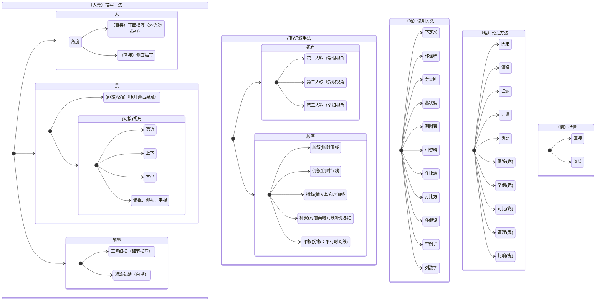
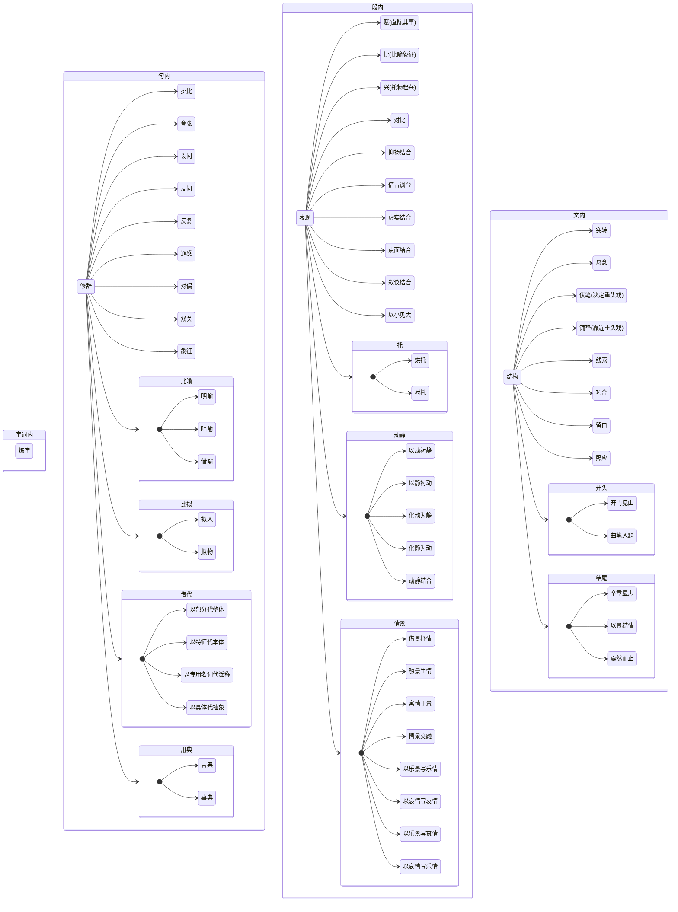
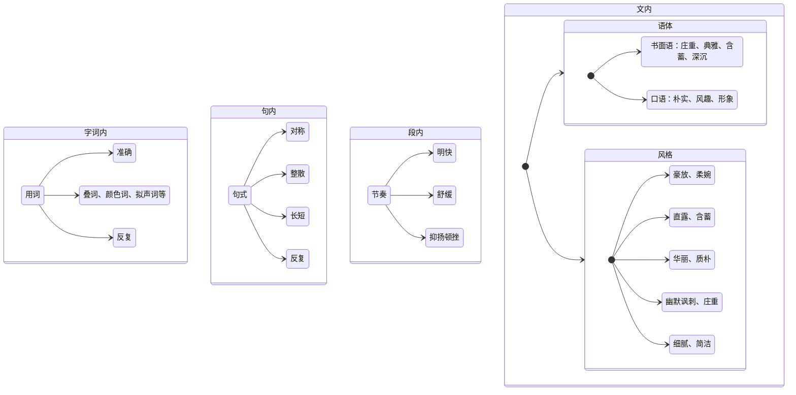

# 阅读

## 概括
<font color=#39c5bb>找定删联</font>

```json
{
    "找":"找特征",    
    "定":"定范围",    
    "删":"删重复",    
    "联":"联逻辑"    
}
```


## 手法效果赏析
<font color=#ffa500>

||<文字手法>|<语言特色>|人-描写手法|物-说明方法|事-叙述手法|情-抒情手法|景-描写手法|理-议论方法|
|---|---|---|---|---|---|---|---|---|
|字词|炼字|用词|||||||
|句|修辞|句式|||||||
|段|表现|节奏|||||||
|文|结构|语体，风格|||||||

</font>


* 对象手法


*  文字手法




* 语言特色




## 作用
 <font color=#39c5bb>(具体分析+套话)，套话如下:</font>    

```json
{

    "人物":{
        "突出(人物的特征)",
        "塑造(人物的形象、性格、心理)",    
        "暗示(人物的命运)",    
        "烘托(人物情感)",    
        "引入(人物出场)",     
        "推动(情节发展)",
        "见证(情节发展)"
    },

    "事":{
        "开端":"制造悬念；引起下文；吸引读者",    
        "发展":"承上启下；埋伏笔、做铺垫",    
        "高潮":"冲突制造巧合、突转；使情节跌宕起伏、扣人心弦",    
        "结局":"照应上文；收束全文；留有余味、想象空间",    

        "线索":"贯穿全文、推动情节发展；暗示、表明情节的发展",
        "情节":"使故事更加真实；丰富情节内容",
		"主旨":"暗示、揭示、升华、深化主旨"
    },

    "情":"便于抒情；升华、深化感情",

    "景":[    
        "塑造、暗示、反映、凸显社会环境或自然环境",    
        "渲染气氛，奠定感情基调"    
    ],

    "理":{
        "论点":"揭示了文章的论点",    
        "论据":"属于文章的论据，证明论点；属于论据的一部分，使论据更加真实可信、生动形象",    
        "论证方法":"采用了什么论证方法，使论证更加全面、有针对性",    
        "论证语言":"生动活泼、幽默风趣、有文采、严谨客观",    
        "论证结构":"使结构更加严谨、有层次感等"    
    },


    "字词句段文":{
        "字词句段":"揭示了文本内容",    

        "文":{
            "文章结构":"使结构更加严谨、有层次感",   
            "表达效果":"读起来生动可感、严谨可信、有文学性",    
            "语言特色":"生动活泼、幽默风趣、有文采、严谨客观",    
            "阅读效果":["表现风格",
                        "凸显色彩",
                        "展现现实意义性、真实性",
                        "增强真实性"]   
        }
    }

}
```


# 文言
* 语法    
> <font color=#ff0044>主谓倒装</font>：<font color=#39c5bb>n. v. --> v. n.</font>    
> <font color=#ff0044>宾语前置</font>: <font color=#39c5bb>v. n. --> n. v.</font>    
> <font color=#ff0044>定语后置</font>：<font color=#39c5bb>adj. n. --> n. adj.</font>    
> <font color=#ff0044>状语后置</font>：<font color=#39c5bb>adv. v. --> v. adv.</font>    

> <font color=#ff0044>之</font>：<font color=#39c5bb>取消从句的句子独立性</font>

> <font color=#ff0044>省略句</font>：<font color=#39c5bb>主语宾省，之省，介省</font>

> <font color=#ff0044>判断句</font>：<font color=#39c5bb>……者……也</font>    
> <font color=#ff0044>反问句</font>：<font color=#39c5bb>不亦……乎，孰与……乎，其……乎，安……哉，何……为</font>   
> <font color=#ff0044>被动句</font>：<font color=#39c5bb>为……所……，受……于……，见……于……</font>    
> <font color=#ff0044>固定句式</font>：<font color=#39c5bb>如……何，况……乎，何（以）……为</font>    

# 作文
```json

//倒装(强调部分提前)
//对偶句

{
    "1+3：开头":[
        //单对立主题：xx是xx的通行证，xx是xx的墓志铭。
        //双正反主题：xx诚是贵，xx价更高。若为xx故，二者[皆可抛/全都要]。

        "名言", 

        "材料",
        "生活",
        "中心论点"
    ],
        
    "广深高：分论点":{
        "广":"分类讨论,e.g.1个人->社会(群人百姓)->国家(几群人)->世界(所有人)",
        "深":"是什么->为什么->怎么做",
        "高":"行为->心理->精神智慧",
    },

    "3+1：结尾":{
        "中心论点",

        "歌颂",
        "做法",
        "名言"
    }
}

```

材料：
```json
[
    [
        "想来，【人】在【地\事】，",
        "也曾想起【物和物】，",
        "终是把【情和情】化为了【主旨】"

    //e.g.想来，孔子在说出“吾与点也”时，也曾想起高台上的微风，春水畔的落日，
    //终是把奔走六国的雄心，建设大治之世的野望，化成了一种淡泊的平常。
    ],

    [
        "为众人……者，不可使其……，",
        "为自由……者，不可使其……"

    //为众人抱薪者，不可使其冻毙于风雪。为自由开路者，不可使其困厄于荆棘。
    ],
    [
        "",
        ""
    ],
    [
        "",
        ""
    ],

    [
        "",
        ""
    ],
    "",
    "",
    ""

]
```


<font color=#ff0044>
<center>Written by Vito Devlin :tada: </center>
<center>condexpr01@outlook.com</center>
</font>
